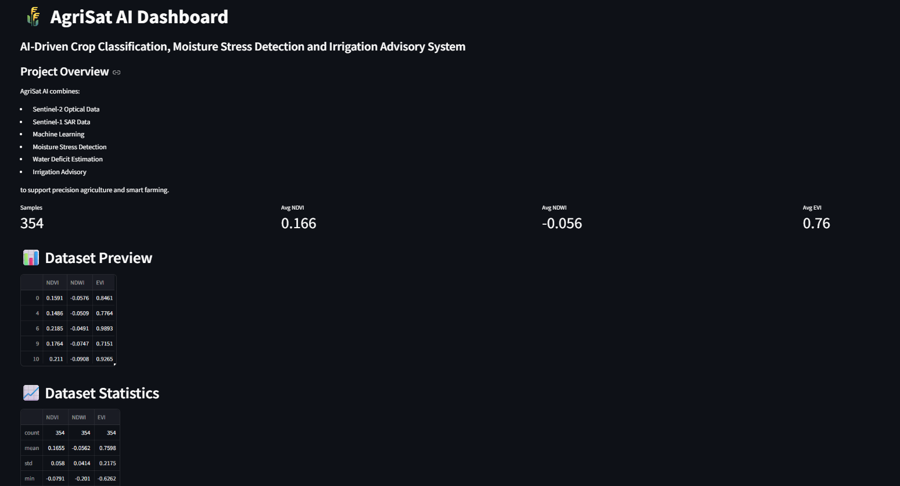

# 🌾 AgriSat AI

### Intelligent Crop Monitoring and Irrigation Advisory System

AI-driven crop classification, moisture stress detection, and irrigation advisory generation using Sentinel-1 SAR and Sentinel-2 Optical satellite data.

---

## Dashboard Preview



---

## Project Overview

AgriSat AI combines:

- Sentinel-2 Optical Data
- Sentinel-1 SAR Data
- Machine Learning
- Moisture Stress Detection
- Water Deficit Estimation
- Irrigation Advisory

to support precision agriculture and smart farming.


## Features

### Satellite Feature Extraction

- NDVI
- NDWI
- EVI

from Sentinel-2 imagery using Google Earth Engine.

### SAR Analysis

- VV Polarization
- VH Polarization

from Sentinel-1 imagery.

### Crop Classification

Random Forest-based crop classification pipeline.

### Moisture Stress Detection

Vegetation Condition Index (VCI) based stress monitoring:

- Healthy
- Mild Stress
- Moderate Stress
- Severe Stress

### Irrigation Advisory

Automated irrigation recommendations based on stress and water deficit analysis.

### Dashboard

Interactive Streamlit dashboard for visualization and analysis.

---

## Project Structure

```text
AGRISAT_AI/
│
├── data/
│   ├── AgriSat_Features.csv
│   ├── SAR_Features.csv
│   └── crop_labels.csv
│
├── models/
│   └── crop_model.pkl
│
├── src/
│   ├── dashboard.py
│   ├── data_analysis.py
│   ├── moisture_stress.py
│   ├── phenology.py
│   ├── train_crop_model.py
│   └── water_deficit.py
│
├── screenshots/
├── requirements.txt
├── README.md
└── LICENSE

Installation

git clone https://github.com/dhiraj0-del/AgriSat-AI.git
cd AGRISAT_AI

pip install -r requirements.txt


Run Dashboard

streamlit run src/dashboard.py


Technologies Used

Python
Google Earth Engine
Streamlit
Pandas
NumPy
Scikit-Learn
Matplotlib
Sentinel-1
Sentinel-2


System Architecture

┌──────────────────────┐
│  Sentinel-2 Optical  │
│       Satellite      │
└──────────┬───────────┘
           │
           ▼
┌──────────────────────┐
│  NDVI / NDWI / EVI   │
│ Feature Extraction   │
└──────────┬───────────┘
           │
           ▼
┌──────────────────────┐
│ Sentinel-1 SAR Data  │
│      VV / VH         │
└──────────┬───────────┘
           │
           ▼
┌──────────────────────┐
│ Feature Integration  │
└──────────┬───────────┘
           │
           ▼
┌──────────────────────┐
│ Random Forest Model  │
└──────────┬───────────┘
           │
           ▼
┌──────────────────────┐
│ Crop Classification  │
└──────────┬───────────┘
           │
           ▼
┌──────────────────────┐
│ Phenology Analysis   │
└──────────┬───────────┘
           │
           ▼
┌──────────────────────┐
│ Moisture Stress      │
│ Detection (VCI)      │
└──────────┬───────────┘
           │
           ▼
┌──────────────────────┐
│ Water Deficit        │
│ Estimation           │
└──────────┬───────────┘
           │
           ▼
┌──────────────────────┐
│ Irrigation Advisory  │
└──────────┬───────────┘
           │
           ▼
┌──────────────────────┐
│ Streamlit Dashboard  │
└──────────────────────┘


 Future Scope


Interactive Farmer Dashboard
Real-Time Weather Integration
AI Agronomist Chatbot
Yield Prediction
Mobile Application


Developer

A V D Dhiraj